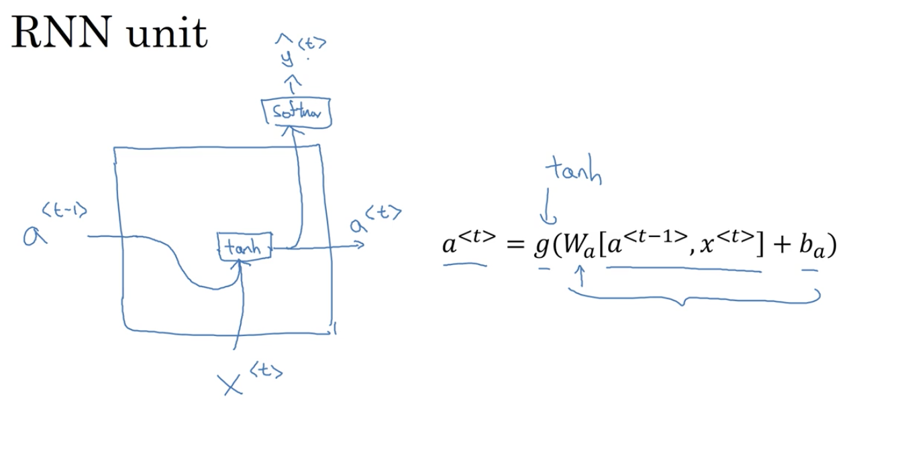
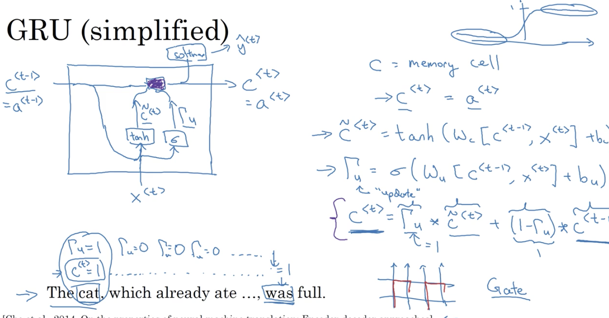
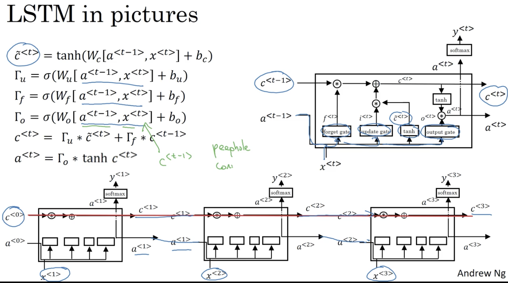

# Sequence Models
## Examples:
- Music Generation
- Video Activity recognition
- Sentiment Classification
- ...

## Motivating Examples
Finding names for search engines.
**Input:**
- x: sentence
- y: name with starting/end position of the index

## Recurrent Neural Networks
The vertical parameters: `W_ax` and the horizontal parameters `W_aa` are shared throught the whole network.
### Forward Prop
a<t> = g(W_aa * a<t-1> + W_ax * x<t> + b_a) <-- tanh/ReLu
y^<t> = g(W_ya * a<t> + b_y)

#### Simplified RNN notation:
a<t> = g(W_a [a<t-1>; x<t>] + b_a)

W_a = [W_aa, W_ax]

### Back Prop
L<t>(y^<t>, y<t>) = -y<t>log(y^<t>) - (1-y<t>)log(1-y^<t>)

## Types of RNNs

- One-to-one
- One-to-many
- Many-to-one
- Many-to-Many:
  - Flat
  - encoder -> decoder

## Language Model and Sequence generation
### Vanishing gradients
Common for really deep neural Networks (100 layers). And it matters when the word has long-range dependencies. (Long-range connection)

### RNN Unit

#### GRU

#### LSTM
Update Gate, Forget Gate, Output Gate

#### BRNN
For real-time translation, BRNN is very effective

#### Deep RNNs
