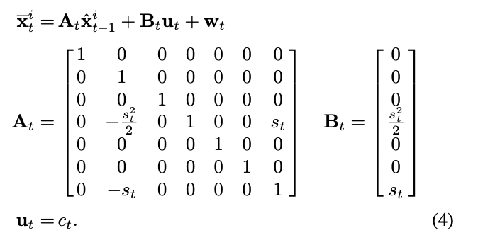

## Lane Model
- Cubic polynomial:
`y = y_{0} + T_{0}*l + \frac{1}{2}*C_{0}*l^2 + \frac{1}{6}*C_1*l^3`

Parameters | meanning
--|--
`y_{0}` | lateral offset
`T_{0}` | heading
`C_{0}` | curvature
`C_{1}` | curvature change

## KF

### State Vectors

```
X = \begin{bmatrix}y_0
\\ T_0
\\ C_0
\\ C_1
\end{bmatrix}
```


### Prediction Step
```
\left\{\begin{matrix} y_0' = y_0 + T_0 * l + \frac{1}{2}*C_0*l^2 + \frac{1} {6}*C_1*l^3 + l * tan(T_0)
\\ T_0' = T_0 + C_0*l + \frac{1}{2}* C_1 + T_v
\\ C_0' = C_0 + C_1 *t
\\ C_1' = C_1
\end{matrix}\right.
```
<a href="https://www.codecogs.com/eqnedit.php?latex=\left\{\begin{matrix}&space;y_0'&space;=&space;y_0&space;&plus;&space;T_0&space;*&space;l&space;&plus;&space;\frac{1}{2}*C_0*l^2&space;&plus;&space;\frac{1}&space;{6}*C_1*l^3&space;&plus;&space;l&space;*&space;tan(T_0)&space;\\&space;T_0'&space;=&space;T_0&space;&plus;&space;C_0*l&space;&plus;&space;\frac{1}{2}*&space;C_1&space;&plus;&space;T_v&space;\\&space;C_0'&space;=&space;C_0&space;&plus;&space;C_1&space;*t&space;\\&space;C_1'&space;=&space;C_1&space;\end{matrix}\right." target="_blank"></a>


## Papers
- link: [Here](https://cv.utcluj.ro/persens/tl_files/persens/Docs/ProbabilisticLaneTracking.pdf)
- KF



